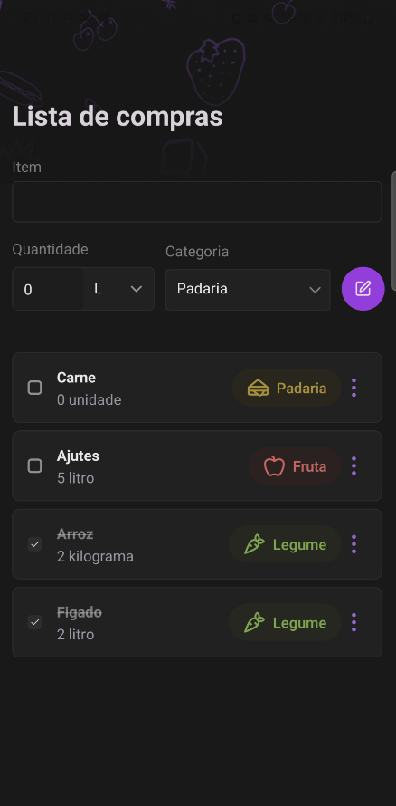
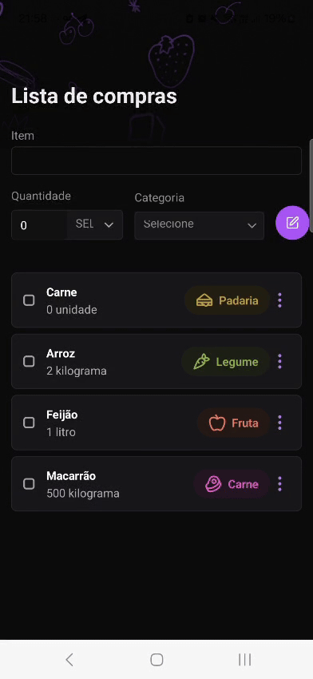
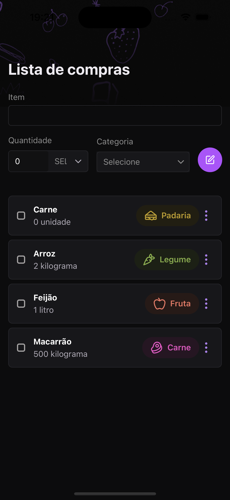

# 📱 Mobile Technical Test

Este repositório contém a solução para um teste técnico de desenvolvimento mobile, utilizando **React Native** com **TypeScript**. O objetivo é demonstrar boas práticas de arquitetura, organização de código e construção de interfaces responsivas com consumo de dados remoto.

## 🚀 Tecnologias Utilizadas

- [React Native](https://reactnative.dev/)
- [TypeScript](https://www.typescriptlang.org/)
- [NativeWind](https://www.nativewind.dev/) – Tailwind CSS adaptado para React Native
- [Gluestack UI](https://gluestack.io/) – Componentes UI acessíveis e performáticos
- [TanStack Query (React Query)](https://tanstack.com/query/latest) – Gerenciamento de cache e requisições assíncronas

## 📱 Pré-visualização

Imagens do aplicativo estão disponíveis abaixo:

### Android




### iOS




## 🚀 Funcionalidades

- **Lista de Compras**: Adicione, visualize e gerencie itens na sua lista de compras.
- **Interface Responsiva**: Design adaptado para dispositivos Android e iOS.
- **Componentes Reutilizáveis**: Uso de componentes como `RegisterFormProduct`, `ProductItemList` e outros.
- **Animações**: Animações suaves utilizando a biblioteca `react-native-reanimated`.

## 🛠️ Estrutura do Projeto

A estrutura principal do projeto é a seguinte:

### Principais Diretórios

- **`app/`**: Contém as telas principais do aplicativo.
- **`assets/`**: Recursos estáticos, como imagens e fontes.
- **`components/`**: Componentes reutilizáveis, como botões, ícones e formulários.
- **`providers/`**: Contextos e provedores, como o `ShoppingListProvider`.
- **`scripts/`**: Scripts utilitários, como o `reset-project.js`.

## ⚙️ Configuração do Ambiente

Para executar este projeto localmente, siga os passos abaixo:

### 1. Clone o repositório

```bash
git clone https://github.com/luca-henrique/mobile-technical-test.git
cd mobile-technical-test
```

### 2. Instale as dependências

```bash
npm install
# ou
yarn install
```

### 3. Configure o ambiente React Native

Siga o guia oficial:

👉 **[Guia de Configuração do Ambiente React Native](https://reactnative.dev/docs/environment-setup)**

> Escolha a opção **React Native CLI Quickstart** e a plataforma do seu sistema operacional.

### 4. Inicie o aplicativo

- **Para Android** (com emulador aberto):

```bash
npx react-native run-android
```

- **Para iOS** (somente em macOS com Xcode):

```bash
npx react-native run-ios
```

---

Se tiver qualquer dúvida durante a configuração ou execução, fique à vontade para abrir uma issue ou entrar em contato.
